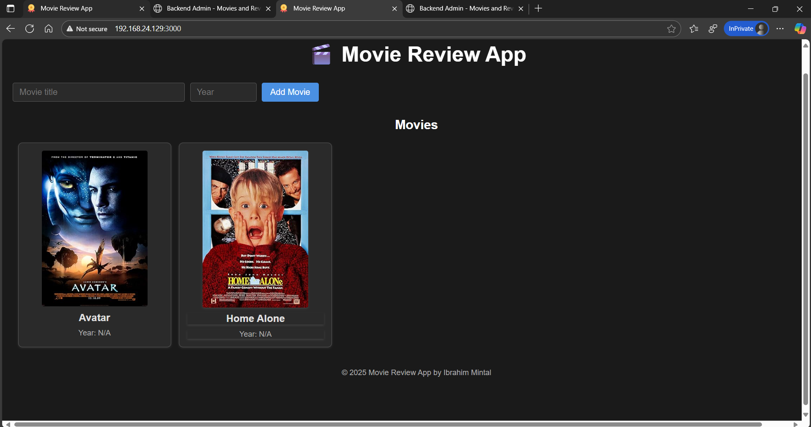
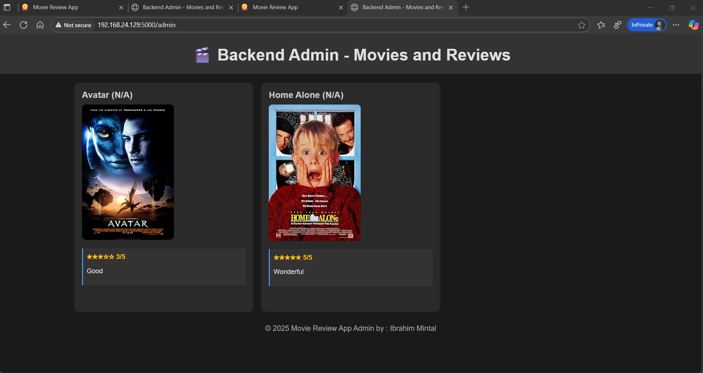

# 🎬 Movie Review App with Automated CI/CD Pipeline

A full-stack web application for managing and reviewing movies, built with React, Node.js, Express, and PostgreSQL. The app integrates with the OMDB API to automatically fetch movie posters and information. This project also includes an **Automated CI/CD Pipeline** for containerized deployment using Docker, Jenkins, and Ansible.

---

## 🔧 Tools Involved

- **Docker** → Containerize frontend, backend, and database.
- **Docker Compose** → Manage multi-container app locally.
- **Jenkins** → Automate build, test, and deployment pipeline.
- **Ansible** → Deploy Docker containers to multiple servers (e.g., staging & production).

---

## 🛠️ Project Workflow

1. **Application Setup**
    - Create a **frontend** (React or simple HTML/NGINX).
    - Create a **backend** (Flask / Node.js / Spring Boot).
    - Use a **database** (Postgres or MySQL).
2. **Dockerization**
    - Write a `Dockerfile` for frontend + backend.
    - Use official DB image (Postgres/MySQL).
    - Create `docker-compose.yml` to run locally.
3. **Jenkins CI Pipeline**
    - Jenkins pulls code from GitHub.
    - Builds Docker images for frontend & backend.
    - Runs unit tests.
    - Pushes Docker images to Docker Hub.
4. **Ansible Deployment (CD)**
    - Ansible playbooks to:
        - Install Docker on target servers.
        - Pull images from Docker Hub.
        - Start containers with correct networking.
    - Deploy to **2 environments**: staging + production.
5. **Final Flow**
    - Developer pushes code to GitHub.
    - Jenkins pipeline builds/test/pushes images.
    - Jenkins triggers Ansible to deploy containers.
    - App updates automatically on target servers.

---

## 🔥 Bonus Extensions

- Use **Nginx reverse proxy** to route frontend → backend.
- Add **Blue/Green deployment** using Ansible.
- Use **Jenkins pipelines as code** (Jenkinsfile).
- Add **automated integration tests** after deployment.

---

👉 This project will give you **real DevOps hands-on** with:

- **Docker** for microservices.
- **Jenkins** for CI/CD.
- **Ansible** for infra automation + deployment.

---

## 🏗️ Architecture

This is a 3-tier web application consisting of:

- **Frontend**: React application served by Nginx
- **Backend**: Node.js/Express API server
- **Database**: PostgreSQL database

## 📁 Project Structure

```
movie-review-app/
├── backend/                 # Node.js/Express API
│   ├── server.js           # Main server file
│   ├── db.js              # Database connection
│   ├── package.json       # Backend dependencies
│   └── Dockerfile         # Backend container config
├── frontend/               # React application
│   ├── src/               # React source code
│   ├── public/            # Static assets
│   ├── package.json       # Frontend dependencies
│   └── Dockerfile         # Frontend container config
├── db/                    # Database files
│   └── init.sql          # Database schema
└── docker-compose.yml     # Container orchestration
```

### Containerized Deployment

The application uses Docker Compose for container orchestration with the following services:

- **movie-frontend**: React app (port 3000)
- **movie-backend**: Express API (port 5000)
- **movie-db**: PostgreSQL database (port 5432)

## ✨ Features

- 📽️ **Movie Management**: Add movies with automatic poster fetching from OMDB API
- ⭐ **Review System**: Add and view reviews with 1-5 star ratings
- 🎨 **Modern UI**: Clean, responsive React interface
- 🔧 **Admin Interface**: Backend admin panel at `/admin` for viewing all movies and reviews
- 🐳 **Docker Support**: Complete containerization for easy deployment
- 📊 **Database Integration**: PostgreSQL with proper schema and relationships

## 📸 Output Results


## 📋 Prerequisites

Before running this application, make sure you have the following installed:

- [Docker](https://docs.docker.com/get-docker/)
- [Docker Compose](https://docs.docker.com/compose/install/)
- [OMDB API Key](http://www.omdbapi.com/apikey.aspx) (free tier available)

## 🚀 Quick Start

### 1. Clone the Repository

```bash
git clone https://github.com/ibrahim-mintal/Jenkins-pipeline-3-teir-Web-App.git
```

### 2. Environment Setup

Create a `.env` file in the root directory:

```env
OMDB_API_KEY=your_omdb_api_key_here
```

### 3. Deploy with Docker-Compose

```bash
# Build and start all services
docker-compose up --build

# Or run in background
docker-compose up -d --build
```

### 4. Access the Application

- **Frontend**: http://localhost:3000
- **Backend API**: http://localhost:5000
- **Admin Panel**: http://localhost:5000/admin
- **Database**: localhost:5432 (accessible from host)

## 📡 API Endpoints

### Movies

- `GET /api/movies` - Get all movies
- `POST /api/movies` - Add a new movie
  - Body: `{ "title": "Movie Title", "year": 2023 }`

### Reviews

- `GET /api/movies/:id/reviews` - Get reviews for a specific movie
- `POST /api/movies/:id/review` - Add a review for a movie
  - Body: `{ "review_text": "Great movie!", "rating": 5 }`

### Admin

- `GET /admin` - View all movies and reviews in a web interface

## 🔧 Configuration

### Environment Variables

- `OMDB_API_KEY`: Your OMDB API key for fetching movie posters
- `DB_HOST`: Database host (default: db)
- `DB_USER`: Database user (default: postgres)
- `DB_PASSWORD`: Database password (default: postgres)
- `DB_NAME`: Database name (default: moviesdb)

### Docker Configuration

The application uses multi-stage Docker builds for optimized production images:

- **Backend**: Node.js Alpine image with production dependencies
- **Frontend**: Nginx serving built React app
- **Database**: PostgreSQL Alpine image with persistent volume

## 🧪 Testing

### Manual Testing

1. Add a movie using the frontend form
2. Verify the movie appears in the list with a poster
3. Click on a movie to view its details
4. Add a review for the movie
5. Check the admin panel at `/admin` to see all data

### API Testing

```bash
# Get all movies
curl http://localhost:5000/api/movies

# Add a movie
curl -X POST http://localhost:5000/api/movies \
  -H "Content-Type: application/json" \
  -d '{"title": "The Matrix", "year": 1999}'
```

## 🚀 Deployment

### Production Deployment

1. Set up your production environment with Docker and Docker Compose
2. Configure environment variables securely
3. Use a reverse proxy (nginx) for SSL termination
4. Set up database backups and monitoring
5. Configure CI/CD pipeline for automated deployments

### Scaling Considerations

- **Database**: Use connection pooling and read replicas for high traffic
- **Backend**: Implement caching and rate limiting
- **Frontend**: Use CDN for static assets
- **Monitoring**: Add logging and monitoring with tools like Prometheus/Grafana

## Deployment Methods

This project supports multiple deployment strategies to suit different environments and requirements.

### 1. Local Deployment with Jenkins Pipeline

Deploy the application locally on the Jenkins server using Docker Compose.

- **Using Jenkinsfile-Deploy**: A simplified pipeline focused solely on deployment.
  - Copies the `.env` file from Jenkins credentials.
  - Runs `docker-compose down -v` to clean up previous containers.
  - Executes `docker-compose up -d --build` to build and start services.
- **Using Full Jenkinsfile**: Includes complete CI/CD with build, test, push, and deploy stages.
  - Builds Docker images for frontend and backend.
  - Pushes images to Docker Hub.
  - Deploys locally using Docker Compose.

**Command to trigger**:
- Configure Jenkins job with the respective `Jenkinsfile`.
- Pipeline triggers on GitHub push or manual build.

### 2. Remote Deployment via Ansible Playbook

Deploy the application to multiple remote servers using Ansible automation.

- **Prerequisites**:
  - Ansible installed on control machine.
  - SSH access configured to target servers.
  - `inventory.ini` configured with server details.
- **Deployment Process**:
  - Installs Docker and required packages on target servers.
  - Syncs application files to `/app` directory.
  - Generates environment files using Jinja2 templates.
  - Runs `docker-compose up -d --build` on each server.

**Command to deploy**:
```bash
ansible-playbook -i inventory.ini playbook.yml
```

This method is ideal for deploying to staging and production environments across multiple servers.

### Next Step: Integrate Ansible with Jenkins

To achieve fully automated CI/CD with remote deployment:

1. **Modify Jenkinsfile**: Add a new "Deploy Remote" stage after "Push Images".
2. **Install Ansible on Jenkins**: Ensure Ansible is available in the Jenkins environment.
3. **Update Pipeline**:
   ```groovy
   stage('Deploy Remote') {
       steps {
           sh 'ansible-playbook -i inventory.ini playbook.yml'
       }
   }
   ```
4. **Benefits**:
   - Complete automation: Code commit → Build → Push → Remote Deploy.
   - Consistent deployments across environments.
   - Rollback capabilities using tagged images.

This integration will streamline the DevOps workflow and enable continuous deployment to production.

## Deployment Results

Below are screenshots showing successful deployments on the target servers.

### Server 1 (debian1 - 192.168.24.129)

| Frontend | Backend |
|----------|---------|
|  |  |

### Server 2 (debian2 - 192.168.24.130)

| Frontend | Backend |
|----------|---------|
|  |  |

### Ansible Deployment Output


---

# 📅 7-Day DevOps Project Plan

### **Day 1 – Project Setup & App Development**

- ✅ Create a GitHub repo.
- ✅ Build a simple **3-tier app**:
    - **Frontend**: React or Nginx static HTML.
    - **Backend**: Flask / Node.js REST API.
    - **Database**: MySQL or PostgreSQL.
- ✅ Run everything locally without Docker first.
- **Deliverable**: Local app working (frontend talks to backend, backend talks to DB).

---

### **Day 2 – Dockerization**

- ✅ Write `Dockerfile` for backend.
- ✅ Write `Dockerfile` for frontend.
- ✅ Use official image for DB.
- ✅ Create `docker-compose.yml` to run all 3 containers together.
- ✅ Test app runs via `docker-compose up`.
- **Deliverable**: Multi-container app running locally.

---

### **Day 3 – Jenkins Setup**

- ✅ Install Jenkins on a local VM or Docker container.
- ✅ Install plugins: Git, Docker, Pipeline.
- ✅ Connect Jenkins to GitHub (webhook or polling).
- ✅ Test a basic job (print "Hello World").
- **Deliverable**: Jenkins up & connected to GitHub.

---

### **Day 4 – Jenkins CI Pipeline**

- ✅ Write `Jenkinsfile` with stages:
    1. Pull code from GitHub.
    2. Build Docker images for frontend & backend.
    3. Run unit tests (if any).
    4. Push Docker images to **Docker Hub**.
- ✅ Trigger pipeline via GitHub push.
- **Deliverable**: Jenkins pipeline builds & pushes images successfully.

---

### **Day 5 – Ansible Setup**

- ✅ Set up **two target servers** (can be VMs on your machine, e.g., staging + prod).
- ✅ Install Ansible on Jenkins server or local machine.
- ✅ Write Ansible playbook:
    - Install Docker on servers.
    - Pull images from Docker Hub.
    - Run containers (frontend, backend, DB).
- ✅ Test deployment manually.
- **Deliverable**: App deployed on remote servers via Ansible.

---

### **Day 6 – Jenkins + Ansible Integration**

- ✅ Add **deploy stage** in `Jenkinsfile` that runs Ansible playbook.
- ✅ Run full pipeline:
    1. Code commit → Jenkins builds → Docker Hub → Ansible deploys.
- ✅ Verify app updates automatically on staging/prod servers.
- **Deliverable**: Fully automated CI/CD pipeline.

---

### **Day 7 – Testing & Enhancements**

- ✅ Push multiple commits → verify pipeline updates app correctly.
- ✅ Add **reverse proxy (Nginx)** in front of backend + frontend.
- ✅ (Optional) Add **Blue-Green Deployment** with Ansible.
- ✅ (Optional) Add integration tests in Jenkins pipeline.
- ✅ Document the full setup (README with screenshots + commands).
- **Deliverable**: Completed documented project.

---

## 🤝 Contributing

1. Fork the repository
2. Create a feature branch (`git checkout -b feature/amazing-feature`)
3. Commit your changes (`git commit -m 'Add amazing feature'`)
4. Push to the branch (`git push origin feature/amazing-feature`)
5. Open a Pull Request
