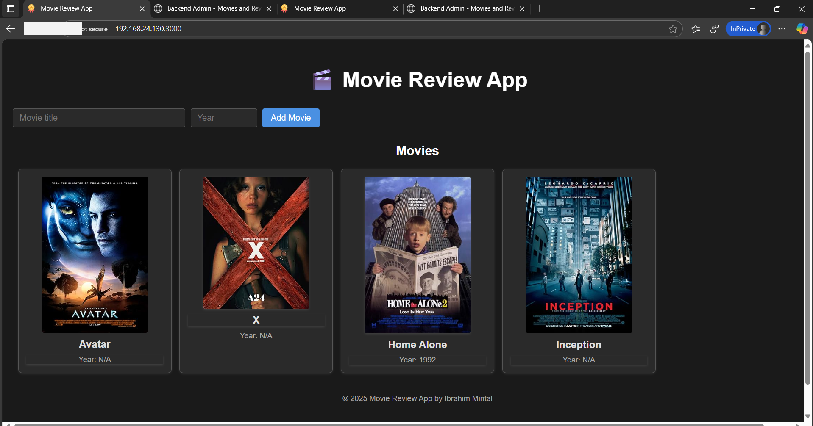
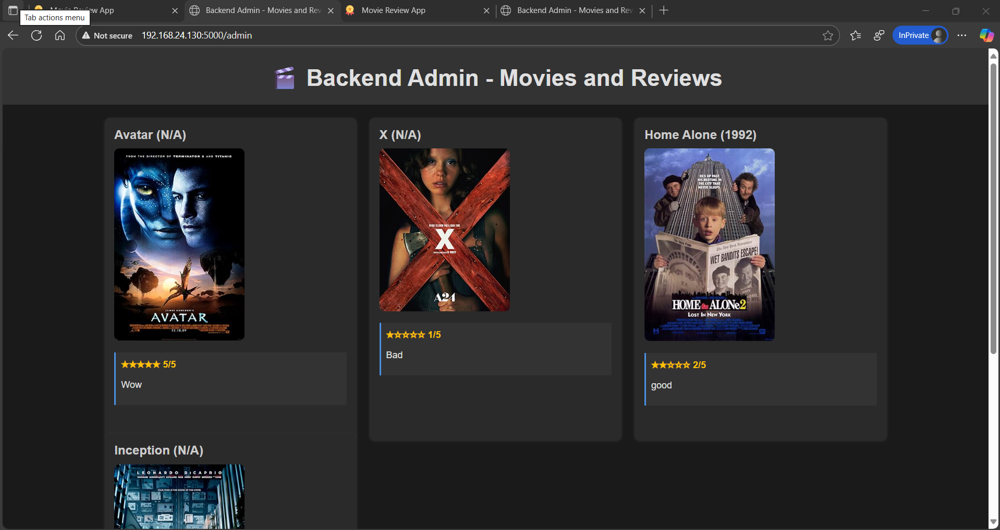
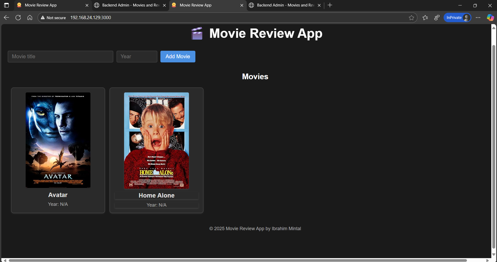
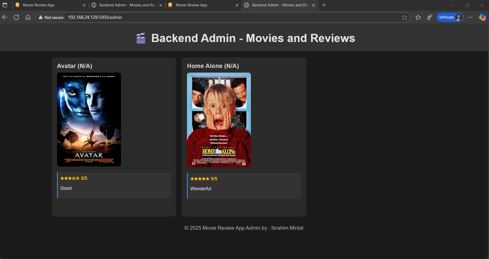

# 🎬 Movie Review App with Automated CI/CD Pipeline

A full-stack web application for managing and reviewing movies, built with React, Node.js, Express, and PostgreSQL. The app integrates with the OMDB API to automatically fetch movie posters and information. This project also includes an **Automated CI/CD Pipeline** for containerized deployment using Docker, Jenkins, and Ansible.

---

## 🔧 Tools Involved

- **Docker** → Containerize frontend, backend, and database.
- **Docker Compose** → Manage multi-container app locally.
- **Jenkins** → Automate build, test, and deployment pipeline.
- **Ansible** → Deploy Docker containers to multiple servers (e.g., staging & production).

---

## 🛠️ Project Workflow

1. **Application Setup**
    - Create a **frontend** (React or simple HTML/NGINX).
    - Create a **backend** (Flask / Node.js / Spring Boot).
    - Use a **database** (Postgres or MySQL).
2. **Dockerization**
    - Write a `Dockerfile` for frontend + backend.
    - Use official DB image (Postgres/MySQL).
    - Create `docker-compose.yml` to run locally.
3. **Jenkins CI Pipeline**
    - Jenkins pulls code from GitHub.
    - Builds Docker images for frontend & backend.
    - Runs unit tests.
    - Pushes Docker images to Docker Hub.
4. **Ansible Deployment (CD)**
    - Ansible playbooks to:
        - Install Docker on target servers.
        - Pull images from Docker Hub.
        - Start containers with correct networking.
    - Deploy to **2 environments**: staging + production.
5. **Final Flow**
    - Developer pushes code to GitHub.
    - Jenkins pipeline builds/test/pushes images.
    - Jenkins triggers Ansible to deploy containers.
    - App updates automatically on target servers.

---

👉 This project will give you **real DevOps hands-on** with:

- **Docker** for microservices.
- **Jenkins** for CI/CD.
- **Ansible** for infra automation + deployment.

---

## 🏗️ Architecture

This is a 3-tier web application consisting of:

- **Frontend**: React application served by Nginx
- **Backend**: Node.js/Express API server
- **Database**: PostgreSQL database

## 📁 Project Structure

```
movie-review-app/
├── backend/                 # Node.js/Express API
│   ├── server.js           # Main server file
│   ├── db.js              # Database connection
│   ├── package.json       # Backend dependencies
│   └── Dockerfile         # Backend container config
├── frontend/               # React application
│   ├── src/               # React source code
│   ├── public/            # Static assets
│   ├── package.json       # Frontend dependencies
│   └── Dockerfile         # Frontend container config
├── db/                    # Database files
│   └── init.sql          # Database schema
├── templates/             # Ansible Jinja2 templates
│   └── frontend.env.j2    # Environment template for frontend
├── ansible.cfg            # Ansible configuration
├── inventory.ini          # Ansible inventory with server details
├── playbook.yml           # Ansible playbook for deployment
├── Jenkinsfile            # Jenkins pipeline definition
├── docker-compose.yml     # Container orchestration
├── install_docker.sh      # Docker installation script
└── .gitignore             # Git ignore file
```

### Containerized Deployment

The application uses Docker Compose for container orchestration with the following services:

- **movie-frontend**: React app (port 3000)
- **movie-backend**: Express API (port 5000)
- **movie-db**: PostgreSQL database (port 5432)

## ✨ Features

- 📽️ **Movie Management**: Add movies with automatic poster fetching from OMDB API
- ⭐ **Review System**: Add and view reviews with 1-5 star ratings
- 🎨 **Modern UI**: Clean, responsive React interface
- 🔧 **Admin Interface**: Backend admin panel at `/admin` for viewing all movies and reviews
- 🐳 **Docker Support**: Complete containerization for easy deployment
- 📊 **Database Integration**: PostgreSQL with proper schema and relationships

## 📸 Output Results


## 📋 Prerequisites

Before running this application, make sure you have the following installed:

- [Docker](https://docs.docker.com/get-docker/)
- [Docker Compose](https://docs.docker.com/compose/install/)
- [OMDB API Key](http://www.omdbapi.com/apikey.aspx) (free tier available)

## 🚀 Quick Start (Locally)

### 1. Clone the Repository

```bash
git clone https://github.com/ibrahim-mintal/Jenkins-pipeline-3-teir-Web-App.git
```

### 2. Environment Setup

Create a `.env` file in the root directory:

```env
OMDB_API_KEY=your_omdb_api_key_here
```

### 3. Deploy with Ansible

```bash
# Build and start all services

 ansible-playbook -i inventory.ini playbook.yml 
```

### 4. Access the Application Locally

- **Frontend**: http://localhost:3000
- **Backend API**: http://localhost:5000
- **Admin Panel**: http://localhost:5000/admin
- **Database**: localhost:5432 (accessible from host)

### 5. Access the Application Remotely

After deployment to remote servers, access the application using the server IP addresses:

- **Staging Server (192.168.24.129)**:
  - **Frontend**: http://192.168.24.129:3000
  - **Backend API**: http://192.168.24.129:5000
  - **Admin Panel**: http://192.168.24.129:5000/admin

- **Production Server (192.168.24.130)**:
  - **Frontend**: http://192.168.24.130:3000
  - **Backend API**: http://192.168.24.130:5000
  - **Admin Panel**: http://192.168.24.130:5000/admin

**Note**: Ensure that the remote servers have the necessary firewall rules to allow access to ports 3000 and 5000.

## 📡 API Endpoints

### Movies

- `GET /api/movies` - Get all movies
- `POST /api/movies` - Add a new movie
  - Body: `{ "title": "Movie Title", "year": 2023 }`

### Reviews

- `GET /api/movies/:id/reviews` - Get reviews for a specific movie
- `POST /api/movies/:id/review` - Add a review for a movie
  - Body: `{ "review_text": "Great movie!", "rating": 5 }`

### Admin

- `GET /admin` - View all movies and reviews in a web interface

## 🔧 Configuration

### Environment Variables

- `OMDB_API_KEY`: Your OMDB API key for fetching movie posters
- `DB_HOST`: Database host (default: db)
- `DB_USER`: Database user (default: postgres)
- `DB_PASSWORD`: Database password (default: postgres)
- `DB_NAME`: Database name (default: moviesdb)

### Docker Configuration

The application uses multi-stage Docker builds for optimized production images:

- **Backend**: Node.js Alpine image with production dependencies
- **Frontend**: Nginx serving built React app
- **Database**: PostgreSQL Alpine image with persistent volume

## 🧪 Testing

### Manual Testing

1. Add a movie using the frontend form
2. Verify the movie appears in the list with a poster
3. Click on a movie to view its details
4. Add a review for the movie
5. Check the admin panel at `/admin` to see all data

### API Testing

```bash
# Get all movies
curl http://localhost:5000/api/movies

# Add a movie
curl -X POST http://localhost:5000/api/movies \
  -H "Content-Type: application/json" \
  -d '{"title": "The Matrix", "year": 1999}'
```

## 🚀 Deployment

### Production Deployment

1. Set up your production environment with Ansible playbook
2. Configure environment variables securely
5. Configure CI/CD pipeline for automated deployments

## Deployment Method

This project uses a single deployment method for simplicity and consistency:

### Jenkins Pipeline with Ansible Playbook

The Jenkins pipeline automates the entire CI/CD process, including building Docker images, pushing them to Docker Hub, and deploying the application to remote servers using Ansible.

**Pipeline Stages**:
1. **Checkout**: Pulls the latest code from the GitHub repository.
2. **Build Images**: Builds Docker images for frontend and backend using the respective Dockerfiles.
3. **Push Images**: Logs into Docker Hub and pushes the built images with a version tag (e.g., v1, v2).
4. **Deploy**: Executes the Ansible playbook (`playbook.yml`) to deploy the application to remote servers defined in `inventory.ini`.

**Deployment Process**:
- Ansible installs Docker and required packages on target servers.
- Syncs application files to `/app` directory on each server.
- Generates environment files using Jinja2 templates.
- Runs `docker-compose up -d --build` on each server to start the containers.

**Command to trigger deployment manually**:
```bash
ansible-playbook -i inventory.ini playbook.yml
```

**Benefits**:
- Complete automation: Code commit → Build → Push → Remote Deploy.
- Consistent deployments across environments.
- Rollback capabilities using tagged images.
- Simplified maintenance with a single deployment method.

### Testing Deployments

To verify successful deployment on each server:

- **Server 1 (192.168.24.129)**:
  - Frontend: http://192.168.24.129:3000
  - Backend Admin: http://192.168.24.129:5000/admin

- **Server 2 (192.168.24.130)**:
  - Frontend: http://192.168.24.130:3000
  - Backend Admin: http://192.168.24.130:5000/admin

## Deployment Results

Below are screenshots showing successful deployments on the target servers.

### Server 1 (debian1 - 192.168.24.129)

| Frontend | Backend |
|----------|---------|
|  |  |

### Server 2 (debian2 - 192.168.24.130)

| Frontend | Backend |
|----------|---------|
|  |  |

### Ansible Deployment Output


---

## 🤝 Contributing

1. Fork the repository
2. Create a feature branch (`git checkout -b feature/amazing-feature`)
3. Commit your changes (`git commit -m 'Add amazing feature'`)
4. Push to the branch (`git push origin feature/amazing-feature`)
5. Open a Pull Request
